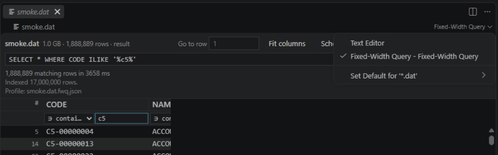
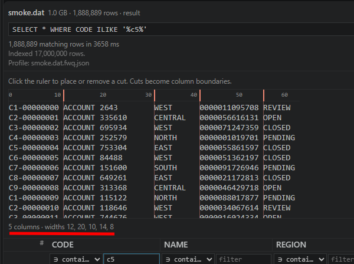
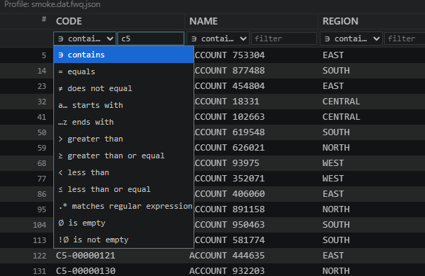

<div align="center">


# Fixed-Width Query

**Open, navigate and query multi-gigabyte fixed-width files in VS Code.**

Mainframe extracts · COBOL copybook layouts · banking record files · application logs

</div>



VS Code refuses to open these files. Its editor materializes the whole document in memory, so it
gives up around 50 MB — and a mainframe extract is routinely a hundred times that.

This extension never loads the file. It reads a viewport at a time, indexes in the background,
and runs queries in a worker thread. **A 50 GB file opens as fast as a 50 KB one.**

---

## What it does

### Define your columns, two ways

Fixed-width by byte offsets, or a regex — either as a field separator (`\s{2,}`, `\t`) or as a
whole-record pattern whose capture groups become the columns.

Typing offsets by hand is how layouts go wrong: one mistake in the third field shifts every field
after it, and the result still looks plausible. So there is a **visual ruler** — click the cut
points against real sample records and watch them land.




### Query it like a table

```sql
SELECT CODE, AMOUNT, STATUS
WHERE REGION = 'NORTH' AND AMOUNT > 50000 AND STATUS NOT LIKE '%CLOSED%'
ORDER BY AMOUNT DESC
LIMIT 100
```

`=` `<>` `<` `<=` `>` `>=` · `LIKE` / `ILIKE` · `IN` · `BETWEEN` · `IS [NOT] NULL` ·
`MATCHES /regex/` · `AND` / `OR` / `NOT` · `ORDER BY` · `LIMIT` / `OFFSET`

Queries run in a worker thread with **progressive results** — matches appear while the scan is
still running — and a Cancel button that actually stops it.

### Or just filter a column

Filter boxes on every column, for when you do not want to write SQL. They compile to the same
engine — and show you the SQL they just built, which is the cheapest SQL tutorial we can ship.



### Save the layout once

A schema profile (`.fwq.json`) saved beside the file reloads automatically. Save it somewhere
shared instead, and apply it to every file with that layout — one copybook usually describes a
whole directory of monthly extracts.

### And the rest

- **Column resizing** — drag an edge, double-click to fit, or Fit columns. Widths persist.
- **Streaming export** to CSV or JSONL, at flat memory regardless of result size.
- **Go to row** — exact and instant, on any row number.
- Handles latin1 / utf8 / ascii, BOM, LF, CRLF and mixed terminators, COBOL trailing signs and
  implied decimal scale.

---

## Measured, not claimed

On a 1.05 GB file of 17,000,000 rows:

| | |
|---|---|
| Time to first row | **6 ms** |
| Index throughput | **1,673 MB/s** — navigable after 193 ms |
| Index memory | **32 KB** for 17M rows (~2 MB per billion) |
| Row block latency, p99 | **2.4 ms** |
| Query scan | **873 MB/s** |
| Memory while browsing | **109 MB**, flat regardless of file size |

The repository ships the harness that produces these numbers (`npm run perf`), so you can
reproduce them on your own data and your own disk.

---

## Getting started

Install, then right-click any data file → **Open in Fixed-Width Query**, or run it from the
command palette.

No profile? The extension infers columns from the file so you see something immediately, and you
refine it from the Schema panel or the ruler.

### Settings

| Setting | Default | Purpose |
|---|---|---|
| `fixedWidthQuery.pageSizeBytes` | 1 MiB | Disk read page size |
| `fixedWidthQuery.pageCacheBytes` | 32 MiB | Hard cache ceiling — memory stays flat regardless of file size |
| `fixedWidthQuery.checkpointStride` | 4096 | Rows between index checkpoints |
| `fixedWidthQuery.defaultEncoding` | `latin1` | Assumed when no schema profile exists |
| `fixedWidthQuery.maxQueryResults` | 2,000,000 | Scan stops and reports truncation past this |
| `fixedWidthQuery.workerHeapMb` | 192 | Per-worker heap cap; a worker that exceeds it dies alone |

### Schema profile format

```jsonc
{
  "version": 1,
  "mode": "fixed",
  "encoding": "latin1",
  "lineEnding": "none",     // no terminator: row N is at N * recordLength, so no index at all
  "recordLength": 512,
  "columns": [
    { "name": "CODE",   "start": 0, "length": 8,  "type": "string",  "trim": "right" },
    { "name": "AMOUNT", "start": 8, "length": 12, "type": "decimal", "scale": 2, "signed": "trailing" }
  ]
}
```

---

## Known limits

Stated plainly, because discovering them after installing is worse.

- **Read-only.** Editing a file too large to rewrite is a different problem; out of scope here.
- **Local files only.** Positional reads do not exist on virtual file systems, so no vscode.dev.
- **`ORDER BY` requires `LIMIT`** — deliberately. Sorting an unbounded result over a file this
  size cannot fit in memory, and failing loudly beats failing at 90%.
- **No JOIN, GROUP BY or aggregates.** One file, one table.
- **Broad queries cost memory.** Browsing is flat in file size, but a result holds roughly 100
  bytes per matching row. Use `LIMIT`, or lower `maxQueryResults`, on queries matching millions.
- Fixed-width offsets are **byte** offsets. Identical to character offsets for latin1/ascii —
  what these formats actually use — but they diverge under utf8.

---

## For developers

```bash
npm install
npm run build     # or: npm run watch
```

Press **F5** to launch the Extension Development Host.

```bash
npm run verify       # typecheck + 39 unit tests + end-to-end smoke against the built workers
npm run perf         # measures the performance SLOs on a generated file
npm run edge-cases   # writes 19 files that break naive implementations
```

The full pre-publish procedure is in [docs/TESTING.md](docs/TESTING.md); architecture and
performance budgets are in [docs/00-PROJECT-CONTEXT.md](docs/00-PROJECT-CONTEXT.md).

### Layers

| Layer | May import | Never imports |
|---|---|---|
| `src/core/**` | nothing | `vscode`, `node:*`, DOM |
| `src/shared/**` | nothing | `vscode`, `node:*`, DOM |
| `src/extension/**` | `vscode`, `node:*`, core, shared | DOM |
| `src/workers/**` | `node:*`, core, shared | `vscode` |
| `src/webview/**` | DOM, core, shared | `vscode`, `node:*` |

Enforced by ESLint, not by convention — see [.eslintrc.cjs](.eslintrc.cjs).

**Zero runtime dependencies.**

---

## License

[MIT](LICENSE) © Samuele Radici
